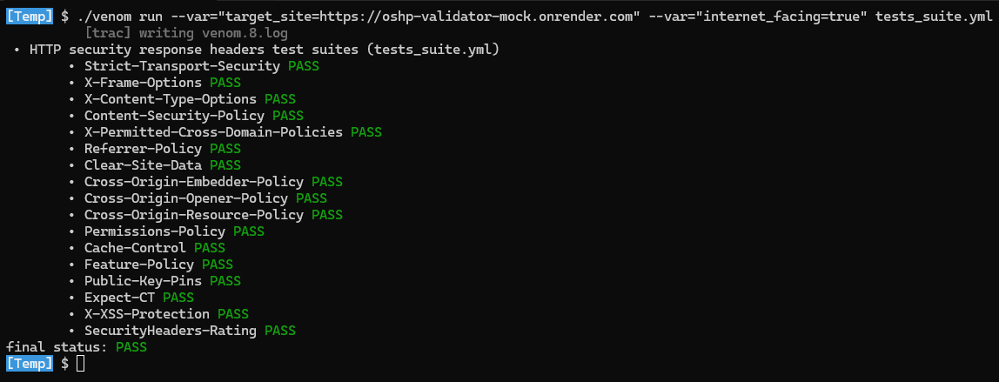

# OWASP Secure Headers Project validator

✅ [Venom](https://github.com/ovh/venom) test suites to validate an [HTTP security response headers](../../mainsite/01_headers.md) configuration against [OSHP recommendation](../../mainsite/03_best_practices.md#configuration-proposal).

🎯 The objective is to provide a way to validate the configuration of non-Internet exposed applications in a flexible/portable way.

💡 You can use the provided test suites, as a foundation, to tailor it to your context.

📑 Syntax for the test suitesfile is validated using this [yamllint](https://yamllint.readthedocs.io) configuration [file](.yamllint).

# Why venom?

🤔 We chose to leverage this tool for the following reasons:

* It is free and open source.
* It does not need any installation: Standalone binary file provided but you can easily compile it if you want a full control over the binary executed.
* It is cross-platform.
* It uses a descriptive approach for a [tests suite](tests_suite.yml) and, then, do not need any code (or coding skills) to add/update a test.

# Tests suite

> [!NOTE]
> ✅ This tests suite is always synchronized with the latest OSHP recommendation.

📋 It is provided via this [single file](tests_suite.yml).

💻 [Visual Studio Code](https://code.visualstudio.com/) is used for the tests suite development. A Visual Studio Code [workspace file](../../project.code-workspace) is provided for the project with [recommended extensions](../../.vscode/extensions.json).

📐 The following parameters are supported:

| **Parameter name**         |                                                                **Description**                                   | **Default value** | **Mandatory** |
|----------------------------|------------------------------------------------------------------------------------------------------------------|-------------------|---------------|
| target_site                | URL of the site for which the headers configuration must be tested.                                              | ""                | Yes           |
| logout_url                 | Relative path to the logout endpoint of the app. Use to test the configuration of the header "Clear-Site-Data".  | ""                | No            |
| request_timeout_in_seconds | Maximum waiting time in seconds for response from the target app.                                                | 20                | No            |

# How to use it?

You can use local installed venom or venom in a container image.

## Local Venom

💻 Follow the steps below.

1. Get a [release of venom](https://github.com/ovh/venom#installing) for your platform.
2. Run one the following commands corresponding to your context:

```bash
# Using default values
$ venom run --var="target_site=https://mysite.com" tests_suite.yml
# Using parameter to specify the logout page for the test of the header "Clear-Site-Data"
$ venom run --var="target_site=https://mysite.com" --var="logout_url=/logout" tests_suite.yml 
```

📽️ Live usage example (the parameter `internet_facing` does not exists anymore, see [here](https://github.com/OWASP/www-project-secure-headers/pull/193) for explanation):

[](demo.mp4)

💡 **Hints:** Venom returns a code different from zero when a test fail or when you try an update and your version is the latest one. Therefore, to prevent your script to fail then add `|| true` at the end of your command.

## Container Image

💻 Follow the steps below.

```bash
docker run --mount type=bind,source=$(pwd)/tests_suite.yml,target=/workdir/tests_suite.yml  ovhcom/venom:latest run --var="target_site=https://mysite.com" tests_suite.yml
```

# Reporting

📖 This [section](https://github.com/ovh/venom#export-tests-report) of the venom documentation describes the different formats supported for the integration in a CI/CD platform.

# Tests suite mock service

🌍 The python script [test_suite_mock.py](test_suite_mock.py) provides a mock endpoint returning an HTTP response, for which, all HTTP response headers recommended by the [OSHP](https://owasp.org/www-project-secure-headers/) will be set.

📦 It is automatically deployed on `https://oshp-validator-mock.onrender.com` and it is used, by this [CI workflow](../../.github/workflows/validator_validate_tests-suite.yml), to test the venom tests suite.

# Case sensitivity for header names in Venom

📖 See [here](https://github.com/ovh/venom/pull/570) from the version [1.2.0](https://github.com/ovh/venom/releases/tag/v1.2.0).
