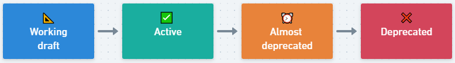

# Response Headers

🚦 Header lifecycle flow:



📐 **Working draft**

* [Permissions-Policy](#permissions-policy)

✅ **Active**

* [Strict-Transport-Security](#strict-transport-security)
* [X-Frame-Options](#x-frame-options)
* [X-Content-Type-Options](#x-content-type-options)
* [Content-Security-Policy](#content-security-policy)
* [X-Permitted-Cross-Domain-Policies](#x-permitted-cross-domain-policies)
* [Referrer-Policy](#referrer-policy)
* [Clear-Site-Data](#clear-site-data)
* [Cross-Origin-Embedder-Policy](#cross-origin-embedder-policy)
* [Cross-Origin-Opener-Policy](#cross-origin-opener-policy)
* [Cross-Origin-Resource-Policy](#cross-origin-resource-policy)
* [Cache-Control](#cache-control)

⏰ **Almost deprecated**

None

❌ **Deprecated**

* [Feature-Policy](#feature-policy)
* [Expect-CT](#expect-ct)
* [Public-Key-Pins](#public-key-pins)
* [X-XSS-Protection](#x-xss-protection)
* [Pragma](#pragma)

## Strict-Transport-Security

HTTP Strict Transport Security (also named *HSTS*) is a web security policy mechanism which helps to protect websites against protocol downgrade attacks and cookie hijacking. It allows web servers to declare that web browsers (or other complying user agents) should only interact with it using secure HTTPS connections, and never via the insecure HTTP protocol. HSTS is an IETF standard track protocol and is specified in [RFC 6797](https://www.rfc-editor.org/rfc/rfc6797). A server implements an HSTS policy by supplying a header (`Strict-Transport-Security`) over an HTTPS connection (HSTS headers over HTTP are ignored).

📍 Important note about the behavior of the header over a **HTTP connection** (source [Mozilla MDN](https://developer.mozilla.org/en-US/docs/Web/HTTP/Headers/Strict-Transport-Security#description)):

* The `Strict-Transport-Security` header **is ignored by the browser when your site has only been accessed using HTTP**.
* Once your site is accessed over HTTPS **with no certificate errors**, the browser knows your site is HTTPS capable and will honor the `Strict-Transport-Security` header.

💡 If you need to let the access open, via HTTP, to the web server but want to ensure that `Strict-Transport-Security` header is taken into account for your site then you can use the **[preload](https://developer.mozilla.org/en-US/docs/Web/HTTP/Headers/Strict-Transport-Security#preloading_strict_transport_security)** directive.

### Values

| Value               | Description |
|---------------------|-------------|
| `max-age=SECONDS`   | The time, in seconds, that the browser should remember that this site is only to be accessed using HTTPS. |
| `includeSubDomains` | If this optional parameter is specified, this rule applies to all of the site's subdomains as well. |
| `preload` | If this optional parameter is specified, its instruct the browser to always access the site using HTTPS because the site is included into `Strict-Transport-Security` [preload list](https://www.chromium.org/hsts/). |

### Example

```
Strict-Transport-Security: max-age=31536000
```

```
Strict-Transport-Security: max-age=31536000 ; includeSubDomains
```

```
Strict-Transport-Security: max-age=31536000 ; includeSubDomains ; preload
```

### References

* <https://tools.ietf.org/html/rfc6797>
* <https://cheatsheetseries.owasp.org/cheatsheets/HTTP_Strict_Transport_Security_Cheat_Sheet.html>
* <https://owasp.org/www-project-web-security-testing-guide/stable/4-Web_Application_Security_Testing/02-Configuration_and_Deployment_Management_Testing/07-Test_HTTP_Strict_Transport_Security.html>
* <https://en.wikipedia.org/wiki/HTTP_Strict_Transport_Security>
* <https://www.chromium.org/hsts>
* <https://hstspreload.org/>
* <https://developer.mozilla.org/en-US/docs/Web/Security/HTTP_strict_transport_security>
* <https://raymii.org/s/tutorials/HTTP_Strict_Transport_Security_for_Apache_NGINX_and_Lighttpd.html>
* <https://blogs.windows.com/msedgedev/2015/06/09/http-strict-transport-security-comes-to-internet-explorer-11-on-windows-8-1-and-windows-7/>

## X-Frame-Options

The `X-Frame-Options` response header (also named **XFO**) improves the protection of web applications against [clickjacking](https://portswigger.net/web-security/clickjacking). It instructs the browser whether the content can be displayed within frames.

The Content-Security-Policy (CSP) [frame-ancestors](https://developer.mozilla.org/en-US/docs/Web/HTTP/Headers/Content-Security-Policy/frame-ancestors) directive obsoletes the X-Frame-Options header. If a resource has both policies, the CSP frame-ancestors policy will be enforced and the X-Frame-Options policy will be ignored.

### Values

| Value                | Description |
|----------------------|-------------|
| `deny`               | No rendering within a frame. |
| `sameorigin`         | No rendering if origin mismatch. |
| `allow-from: DOMAIN` | Allows rendering if framed by frame loaded from *DOMAIN* (**not supported by modern browsers**). |

### Example

```
X-Frame-Options: deny
```

### References

* <https://tools.ietf.org/html/rfc7034>
* <https://tools.ietf.org/html/draft-ietf-websec-x-frame-options-01>
* <https://tools.ietf.org/html/draft-ietf-websec-frame-options-00>
* <https://developer.mozilla.org/en-US/docs/Web/HTTP/X-Frame-Options>
* <https://portswigger.net/web-security/clickjacking>
* <https://blogs.msdn.microsoft.com/ieinternals/2010/03/30/combating-clickjacking-with-x-frame-options/>
* <https://developer.mozilla.org/en-US/docs/Web/HTTP/Headers/Content-Security-Policy/frame-ancestors>

## X-Content-Type-Options

Setting this header will prevent the browser from interpreting files as a different MIME type to what is specified in the `Content-Type` HTTP header (e.g. treating `text/plain` as `text/css`).

### Values

| Value     | Description |
|-----------|-------------|
| `nosniff` | Will prevent the browser from MIME-sniffing a response away from the declared content-type. |

### Example

```
X-Content-Type-Options: nosniff
```

### References

* <https://msdn.microsoft.com/en-us/library/gg622941%28v=vs.85%29.aspx>
* <https://blogs.msdn.microsoft.com/ie/2008/09/02/ie8-security-part-vi-beta-2-update/>
* <https://developer.mozilla.org/en-US/docs/Web/HTTP/Headers/X-Content-Type-Options>

## Content-Security-Policy

A Content Security Policy (also named CSP) requires careful tuning and precise definition of the policy. If enabled, CSP has significant impact on the way browsers render pages (e.g., inline JavaScript is disabled by default and must be explicitly allowed in the policy). CSP prevents a wide range of attacks, including cross-site scripting and other cross-site injections.

### Values

| Directive                   | Description |
|-----------------------------|-------------|
| `base-uri`                  | Define the base URI for relative URIs. |
| `default-src`               | Define loading policy for all resources type in case a resource type's dedicated directive is not defined (fallback). |
| `script-src`                | Define which scripts the protected resource can execute. |
| `object-src`                | Define from where the protected resource can load plugins. |
| `style-src`                 | Define which styles (CSS) can be applied to the protected resource. |
| `img-src`                   | Define from where the protected resource can load images. |
| `media-src`                 | Define from where the protected resource can load video and audio. |
| `frame-src`                 | *(Deprecated and replaced by `child-src`)* Define from where the protected resource can embed frames. |
| `child-src`                 | Define from where the protected resource can embed frames. |
| `frame-ancestors`           | Define from where the protected resource can be embedded in frames. |
| `font-src`                  | Define from where the protected resource can load fonts. |
| `connect-src`               | Define which URIs the protected resource can load using script interfaces. |
| `manifest-src`              | Define from where the protected resource can load manifests. |
| `form-action`               | Define which URIs can be used as the action of HTML form elements. |
| `sandbox`                   | Specifies an HTML sandbox policy that the user agent applies to the protected resource. |
| `script-nonce`              | Define script execution by requiring the presence of the specified nonce on script elements. |
| `plugin-types`              | Define the set of plugins that can be invoked by the protected resource by limiting the types of resources that can be embedded. |
| `reflected-xss`             | Instruct the user agent to activate or deactivate any heuristics used to filter or block reflected cross-site scripting attacks, equivalent to the effects of the non-standard `X-XSS-Protection` header. |
| `block-all-mixed-content`   | Prevent the user agent from loading mixed content. |
| `upgrade-insecure-requests` | Instruct the user agent to download insecure HTTP resources using HTTPS. |
| `referrer`                  | *(Deprecated)* Define information the user agent can send in the `Referer` header. |
| `report-uri`                | *(Deprecated and replaced by `report-to`)* Specifies a URI to which the user agent sends reports about policy violation. |
| `report-to`                 | Specifies a group (defined in the `Report-To` header) to which the user agent sends reports about policy violation. |

### Example

```
Content-Security-Policy: script-src 'self'
```

### References

* <https://www.w3.org/TR/CSP/>
* <https://developer.mozilla.org/en-US/docs/Web/Security/CSP>
* <https://cheatsheetseries.owasp.org/cheatsheets/Content_Security_Policy_Cheat_Sheet.html>
* <https://scotthelme.co.uk/content-security-policy-an-introduction/>
* <https://report-uri.io>
* <https://content-security-policy.com>
* <https://report-uri.com/home/generate>
* <https://csp-evaluator.withgoogle.com/>

## X-Permitted-Cross-Domain-Policies

A cross-domain policy file is an XML document that grants a web client, such as Adobe Flash Player or Adobe Acrobat (though not necessarily limited to these), permission to handle data across domains. When clients request content hosted on a particular source domain and that content makes requests directed towards a domain other than its own, the remote domain needs to host a cross-domain policy file that grants access to the source domain, allowing the client to continue the transaction. Normally a meta-policy is declared in the master policy file, but for those who can’t write to the root directory, they can also declare a meta-policy using the `X-Permitted-Cross-Domain-Policies` HTTP response header.

### Values

| Value             | Description |
|-------------------|-------------|
| `none`            | No policy files are allowed anywhere on the target server, including this master policy file. |
| `master-only`     | Only this master policy file is allowed. |
| `by-content-type` | [HTTP/HTTPS only] Only policy files served with Content-Type: text/x-cross-domain-policy are allowed. |
| `by-ftp-filename` | [FTP only] Only policy files whose file names are crossdomain.xml (i.e. URLs ending in /crossdomain.xml) are allowed. |
| `all`             | All policy files on this target domain are allowed. |

### Example

```
X-Permitted-Cross-Domain-Policies: none
```

### References

<!-- markdown-link-check-disable -->
* <https://www.adobe.com/devnet-docs/acrobatetk/tools/AppSec/xdomain.html>
<!-- markdown-link-check-disable -->
* <https://danielnixon.org/http-security-headers/>
* <https://rorsecurity.info/portfolio/new-http-headers-for-more-security>
* <https://github.com/twitter/secureheaders/issues/88>
* <https://gf.dev/cross-domain-policy-test>

## Referrer-Policy

The `Referrer-Policy` HTTP header governs which referrer information, sent in the `Referer` header, should be included with requests made.

### Values

| Value                             | Description |
|-----------------------------------|-------------|
| `no-referrer`                     | The `Referer` header will be omitted entirely. No referrer information is sent along with requests. |
| `no-referrer-when-downgrade`      | This is the user agent's default behavior if no policy is specified. The origin is sent as referrer to a-priori as-much-secure destination (HTTPS → HTTPS), but isn't sent to a less secure destination (HTTPS → HTTP). |
| `origin`                          | Only send the origin of the document as the referrer in all cases. (e.g. the document `https://example.com/page.html` will send the referrer `https://example.com/`.) |
| `origin-when-cross-origin`        | Send a full URL when performing a same-origin request, but only send the origin of the document for other cases. |
| `same-origin`                     | A referrer will be sent for same-site origins, but cross-origin requests will contain no referrer information. |
| `strict-origin`                   | Only send the origin of the document as the referrer to a-priori as-much-secure destination (HTTPS → HTTPS), but don't send it to a less secure destination (HTTPS → HTTP). |
| `strict-origin-when-cross-origin` | Send a full URL when performing a same-origin request, only send the origin of the document to a-priori as-much-secure destination (HTTPS → HTTPS), and send no header to a less secure destination (HTTPS → HTTP). |
| `unsafe-url`                      | Send a full URL (stripped from parameters) when performing a same-origin or cross-origin request. |

### Example

```
Referrer-Policy: no-referrer
```

### References

* <https://www.w3.org/TR/referrer-policy/>
* <https://developer.mozilla.org/en-US/docs/Web/HTTP/Headers/Referrer-Policy>

## Clear-Site-Data

The Clear-Site-Data header clears browsing data (cookies, storage, cache) associated with the requesting website. It allows web developers to have more control over the data stored locally by a browser for their origins (source [Mozilla MDN](https://developer.mozilla.org/en-US/docs/Web/HTTP/Headers/Clear-Site-Data)). This header is useful for example, during a logout process, in order to ensure that all stored content on the client side like cookies, storage and cache are removed.

### Values

| Value               | Description |
|---------------------|-------------|
| `"cache"`   | Indicates that the server wishes to remove locally cached data for the origin of the response URL. |
| `"cookies"` | Indicates that the server wishes to remove all cookies for the origin of the response URL. HTTP authentication credentials are also cleared out. This affects the entire registered domain, including subdomains. |
| `"storage"` | Indicates that the server wishes to remove all DOM storage for the origin of the response URL. |
| `"executionContexts"` | Indicates that the server wishes to reload all browsing contexts for the origin of the response. Currently, this value is only supported by a small subset of browsers. |
| `"*"` | Indicates that the server wishes to clear all types of data for the origin of the response. If more data types are added in future versions of this header, they will also be covered by it. |

### Example

```
Clear-Site-Data: "cache","cookies","storage"
```

### References

* <https://w3c.github.io/webappsec-clear-site-data/>
* <https://developer.mozilla.org/en-US/docs/Web/HTTP/Headers/Clear-Site-Data>
* <https://www.chromestatus.com/feature/4713262029471744>
* <https://github.com/w3c/webappsec-clear-site-data>
* <https://github.com/w3c/webappsec-clear-site-data/tree/master/demo>

## Cross-Origin-Resource-Policy

This response header (also named CORP) allows to define a policy that lets web sites and applications opt in to protection against certain requests from other origins (such as those issued with elements like `<script>` and ``), to mitigate speculative [side-channel attacks](https://en.wikipedia.org/wiki/Side-channel_attack), like [Spectre](https://spectreattack.com/), as well as [Cross-Site Script Inclusion (XSSI)](https://www.scip.ch/en/?labs.20160414) attacks (source [Mozilla MDN](https://developer.mozilla.org/en-US/docs/Web/HTTP/Headers/Cross-Origin-Resource-Policy)).

💡 To fully understand where **CORP** and **COEP** work:

* CORP applies on the loaded resource side (resource owner).
* COEP applies on the "loader" of the resource side (consumer of the resource).

### Values

| Value               | Description |
|---------------------|-------------|
| `same-site`   | Only requests from the same [Site](https://developer.mozilla.org/en-US/docs/Glossary/Site) can read the resource. |
| `same-origin` | Only requests from the same [Origin](https://developer.mozilla.org/en-US/docs/Glossary/Origin) (i.e. scheme + host + port) can read the resource. |
| `cross-origin` | Requests from any [Origin](https://developer.mozilla.org/en-US/docs/Glossary/Origin) (both `same-site` and `cross-site`) can read the resource. Browsers are using this policy when an [CORP header is not specified](https://resourcepolicy.fyi/#corp-and-isolation). |

### Example

```
Cross-Origin-Resource-Policy: same-origin
```

### References

* <https://fetch.spec.whatwg.org/#cross-origin-resource-policy-header>
* <https://developer.mozilla.org/en-US/docs/Web/HTTP/Headers/Cross-Origin-Resource-Policy>
* <https://caniuse.com/mdn-http_headers_cross-origin-resource-policy>
* <https://web.dev/articles/why-coop-coep#corp>
* <https://web.dev/articles/cross-origin-isolation-guide>
* <https://resourcepolicy.fyi/>

## Cross-Origin-Embedder-Policy

This response header (also named COEP) prevents a document from loading any cross-origin resources that don't explicitly grant the document permission (source [Mozilla MDN](https://developer.mozilla.org/en-US/docs/Web/HTTP/Headers/Cross-Origin-Embedder-Policy)).

💡 To fully understand where **CORP** and **COEP** work:

* CORP applies on the loaded resource side (resource owner).
* COEP applies on the "loader" of the resource side (consumer of the resource).

### Values

| Value               | Description |
|---------------------|-------------|
| `unsafe-none`   | Allows the document to fetch cross-origin resources without giving explicit permission through the [CORS](https://developer.mozilla.org/en-US/docs/Web/HTTP/CORS) protocol or the [Cross-Origin-Resource-Policy](https://developer.mozilla.org/en-US/docs/Web/HTTP/Cross-Origin_Resource_Policy_(CORP)) header (it is the default value). |
| `require-corp` | A document can only load resources from the same origin, or resources explicitly marked as loadable from another origin. |

### Example

```
Cross-Origin-Embedder-Policy: require-corp
```

### References

* <https://html.spec.whatwg.org/multipage/origin.html#coep>
* <https://developer.mozilla.org/en-US/docs/Web/HTTP/Headers/Cross-Origin-Embedder-Policy>
* <https://caniuse.com/mdn-http_headers_cross-origin-embedder-policy>
* <https://web.dev/articles/why-coop-coep#coep>
* <https://web.dev/articles/cross-origin-isolation-guide>

## Cross-Origin-Opener-Policy

This response header (also named COOP) allows you to ensure a top-level document does not share a browsing context group with cross-origin documents. COOP will process-isolate your document and potential attackers can't access to your global object if they were opening it in a popup, preventing a set of cross-origin attacks dubbed [XS-Leaks](https://xsleaks.dev/) (source [Mozilla MDN](https://developer.mozilla.org/en-US/docs/Web/HTTP/Headers/Cross-Origin-Opener-Policy)).

### Values

| Value               | Description |
|---------------------|-------------|
| `unsafe-none`   | Allows the document to be added to its opener's browsing context group unless the opener itself has a COOP of `same-origin` or `same-origin-allow-popups` (it is the default value). |
| `same-origin-allow-popups` | Retains references to newly opened windows or tabs which either don't set COOP or which opt out of isolation by setting a COOP of `unsafe-none`. |
| `same-origin` | Isolates the browsing context exclusively to same-origin documents. Cross-origin documents are not loaded in the same browsing context. |

### Example

```
Cross-Origin-Opener-Policy: same-origin
```

### References

* <https://html.spec.whatwg.org/multipage/origin.html#cross-origin-opener-policies>
* <https://developer.mozilla.org/en-US/docs/Web/HTTP/Headers/Cross-Origin-Opener-Policy>
* <https://caniuse.com/mdn-http_headers_cross-origin-opener-policy>
* <https://web.dev/articles/why-coop-coep#coop>
* <https://web.dev/articles/cross-origin-isolation-guide>
* <https://github.com/xsleaks/xsleaks>
* <https://portswigger.net/daily-swig/xs-leak>
* <https://portswigger.net/research/xs-leak-detecting-ids-using-portal>

## Cache-Control

This header holds directives (instructions) for caching in both **requests** and **responses**. If a given directive is in a request, it does not mean this directive is in the response (source [Mozilla MDN](https://developer.mozilla.org/en-US/docs/Web/HTTP/Headers/Cache-Control)). Specify the capability of a resource to be cached is important to prevent [exposure of information via the cache](https://cwe.mitre.org/data/definitions/525.html).

The headers named [Expires](https://developer.mozilla.org/en-US/docs/Web/HTTP/Headers/Expires) and [Pragma](https://developer.mozilla.org/en-US/docs/Web/HTTP/Headers/Pragma) can be used in addition to the [Cache-Control](https://developer.mozilla.org/en-US/docs/Web/HTTP/Headers/Cache-Control) header. [Pragma](https://developer.mozilla.org/en-US/docs/Web/HTTP/Headers/Pragma) header can be used for backwards compatibility with the HTTP/1.0 caches. However, *Cache-Control* is the recommended way to define the caching policy.

### Values applicable for HTTP responses

| Value               | Description |
|---------------------|-------------|
| `must-revalidate`   | Indicates that once a resource becomes stale, caches do not use their stale copy without successful validation on the origin server. |
| `no-cache` | The response may be stored by any cache, even if the response is normally non-cacheable. However, the stored response **MUST always** go through validation with the origin server first before using it. |
| `no-store` | The response may not be stored in any cache. |
| `no-transform` | An intermediate cache or proxy cannot edit the response body, `Content-Encoding`, `Content-Range`, or `Content-Type`. |
| `public` | The response may be stored by any cache, even if the response is normally non-cacheable. |
| `private` | The response may be stored only by a browser's cache, even if the response is normally non-cacheable. |
| `proxy-revalidate` | Like `must-revalidate`, but only for shared caches (e.g., proxies). Ignored by private caches. |
| `max-age=<seconds>` | The maximum amount of time a resource is considered fresh. Unlike [Expires](https://developer.mozilla.org/en-US/docs/Web/HTTP/Headers/Expires), this directive is relative to the time of the request. |
| `s-maxage=<seconds>` | Overrides `max-age` or the [Expires](https://developer.mozilla.org/en-US/docs/Web/HTTP/Headers/Expires) header, but only for shared caches (e.g., proxies). Ignored by private caches. |

### Extended values

The following directives are not part of the core [HTTP caching standards document](https://datatracker.ietf.org/doc/html/rfc7234). Therefore, check this [table](https://developer.mozilla.org/en-US/docs/Web/HTTP/Headers/Cache-Control#browser_compatibility) for their support.

| Value               | Description |
|---------------------|-------------|
| `immutable`   | Indicates that the response body will not change over time. |
| `stale-while-revalidate=<seconds>`   | Indicates the client can accept a stale response, while asynchronously checking in the background for a fresh one. The **seconds** value indicates how long the client can accept a stale response. |
| `stale-if-error=<seconds>`   | Indicates the client can accept a stale response if the check for a fresh one fails. The **seconds** value indicates how long the client can accept the stale response after the initial expiration. |

### Example

No caching allowed, clear any previously cached resources and include support for HTTP/1.0 caches:

```
Cache-Control: no-store, max-age=0
Pragma: no-cache
```

Caching allowed with a cache duration of one week:

```
Cache-Control: public, max-age=604800
```

### References

* <https://redbot.org>
* <https://developer.mozilla.org/en-US/docs/Web/HTTP/Headers/Cache-Control>
* <https://developer.mozilla.org/en-US/docs/Web/HTTP/Headers/Pragma>
* <https://developer.mozilla.org/en-US/docs/Web/HTTP/Headers/Expires>
* <https://developer.mozilla.org/en-US/docs/Web/HTTP/Caching>
* <https://datatracker.ietf.org/doc/html/rfc7234>
* <https://cwe.mitre.org/data/definitions/524.html>
* <https://cwe.mitre.org/data/definitions/525.html>
* <https://portswigger.net/web-security/web-cache-poisoning>
* <https://portswigger.net/research/practical-web-cache-poisoning>
* <https://portswigger.net/research/web-cache-entanglement>
* <https://portswigger.net/web-security/web-cache-deception>
* <https://portswigger.net/research/gotta-cache-em-all>

## Permissions Policy

> 💻 **Working draft.**

The Permissions-Policy header replaces the existing **Feature-Policy** header for controlling delegation of permissions and powerful features. The header uses a structured syntax, and allows sites to more tightly restrict which origins can be granted access to features (source [Chrome platform status](https://www.chromestatus.com/feature/5745992911552512)).

### Values

🧭 As the specification is still under development, it is better to consult this [page](https://github.com/w3c/webappsec-permissions-policy/blob/main/features.md) to obtain the current list of supported directives.

### Example

```
Permissions-Policy: accelerometer=(),ambient-light-sensor=(),autoplay=(),battery=(),camera=(),display-capture=(),document-domain=(),encrypted-media=(),fullscreen=(),gamepad=(),geolocation=(),gyroscope=(),layout-animations=(self),legacy-image-formats=(self),magnetometer=(),microphone=(),midi=(),oversized-images=(self),payment=(),picture-in-picture=(),publickey-credentials-get=(),speaker-selection=(),sync-xhr=(self),unoptimized-images=(self),unsized-media=(self),usb=(),screen-wake-lock=(),web-share=(),xr-spatial-tracking=()
```

### References

* <https://github.com/w3c/webappsec-permissions-policy/blob/main/permissions-policy-explainer.md>
* <https://developer.mozilla.org/en-US/docs/Web/HTTP/Headers/Feature-Policy#directives>
* <https://caniuse.com/permissions-policy>
* <https://www.w3.org/TR/permissions-policy-1/>
* <https://developer.mozilla.org/en-US/docs/Web/HTTP/Headers/Feature-Policy>
* <https://www.chromestatus.com/feature/5745992911552512>
* <https://www.permissionspolicy.com/>

## Feature-Policy

> **Deprecated**: Replaced by the header *[Permissions-Policy](#permissions-policy)*.

Feature Policy allows web developers to selectively enable, disable, and modify the behavior of certain features and APIs in the browser. It is similar to [Content Security Policy](#content-security-policy) but controls features instead of security behavior (Source [Mozilla MDN](https://developer.mozilla.org/en-US/docs/Web/HTTP/Feature_Policy)).

### Values

Refer to this [page](https://developer.mozilla.org/en-US/docs/Web/HTTP/Headers/Feature-Policy#directives) to obtains the list of supported directives.

### Example

```
Feature-Policy: vibrate 'none'; geolocation 'none'
```

### References

* <https://w3c.github.io/webappsec-feature-policy/>
* <https://scotthelme.co.uk/a-new-security-header-feature-policy/>
* <https://github.com/w3c/webappsec-feature-policy/blob/master/features.md>
* <https://developer.mozilla.org/en-US/docs/Web/HTTP/Headers/Feature-Policy>
* <https://caniuse.com/feature-policy>

## Expect-CT

> **Deprecated.**

> **⚠️ Warning:** This header will likely become obsolete in June 2021. Since May 2018 new certificates are expected to support SCTs by default. Certificates before March 2018 were allowed to have a lifetime of 39 months, those will all be expired in June 2021.

The `Expect-CT` header is used by a server to indicate that browsers should evaluate connections to the host for Certificate Transparency compliance.  
In Chrome 61 (Aug 2017) Chrome enabled its enforcement via SCT by default ([source](https://www.chromestatus.com/feature/5677171733430272)). You can still use this header to specify an `report-uri`.  
  
This header comes from the (now expired) internet draft [Expect-CT Extension for HTTP](https://datatracker.ietf.org/doc/html/rfc9163).

### Values

| Value         | Description |
|---------------|-------------|
| `report-uri`  | *(Optional)* Indicates the URL to which the browser should report Expect-CT failures. |
| `enforce`     | *(Optional)* A valueless directive that, if present, signals to the browser that compliance to the CT Policy should be enforced (rather than report-only) and that the browser should refuse future connections that violate its CT Policy. When both the `enforce` and `report-uri` directives are present, the configuration is referred to as an "enforce-and-report" configuration, signalling to the browser both that compliance to the CT Policy should be enforced and that violations should be reported. |
| `max-age`     | Specifies the number of seconds after the response is received the browser should remember and enforce certificate transparency compliance. |

### Example

```
Expect-CT: max-age=86400, enforce, report-uri="https://foo.example/report"
```

### References

* <https://datatracker.ietf.org/doc/html/rfc9163>
* <https://scotthelme.co.uk/a-new-security-header-expect-ct/>
* <https://www.chromestatus.com/feature/5677171733430272>

## Public-Key-Pins

> **Deprecated.**

> **⚠️ Warning:** This header has been deprecated by all major browsers and is no longer recommended. **Avoid using it**, and update existing code if possible;

HTTP Public Key Pinning (HPKP) is a security mechanism which allows HTTPS websites to resist impersonation by attackers using mis-issued or otherwise fraudulent certificates. (For example, sometimes attackers can compromise certificate authorities, and then can mis-issue certificates for a web origin.).

The HTTPS web server serves a list of public key hashes, and on subsequent connections clients expect that server to use one or more of those public keys in its certificate chain. Deploying HPKP safely will require operational and organizational maturity due to the risk that hosts may make themselves unavailable by pinning to a set of public key hashes that becomes invalid. With care, host operators can greatly reduce the risk of man-in-the-middle (MITM) attacks and other false authentication problems for their users without incurring undue risk.

### Deprecation Reason

Criticism and concern revolved around malicious or human error scenarios known as [HPKP Suicide and Ransom PKP](https://scotthelme.co.uk/using-security-features-to-do-bad-things/). In such scenarios, a website owner would have their ability to publish new contents to their domain severely hampered by either losing access to their own keys or having new keys announced by a malicious attacker.

### Values

| Value                   | Description |
|-------------------------|-------------|
| `pin-sha256="<sha256>"` | The quoted string is the Base64 encoded Subject Public Key Information (SPKI) fingerprint. It is possible to specify multiple pins for different public keys. Some browsers might allow other hashing algorithms than SHA-256 in the future. |
| `max-age=SECONDS`       | The time, in seconds, that the browser should remember that this site is only to be accessed using one of the pinned keys. |
| `includeSubDomains`     | If this optional parameter is specified, this rule applies to all of the site's subdomains as well. |
| `report-uri="<URL>"`    | If this optional parameter is specified, pin validation failures are reported to the given URL. |

### Example

```
Public-Key-Pins: pin-sha256="d6qzRu9zOECb90Uez27xWltNsj0e1Md7GkYYkVoZWmM="; pin-sha256="E9CZ9INDbd+2eRQozYqqbQ2yXLVKB9+xcprMF+44U1g="; report-uri="http://example.com/pkp-report"; max-age=10000; includeSubDomains
```

### References

* <https://tools.ietf.org/html/rfc7469>
* <https://owasp.org/www-community/controls/Certificate_and_Public_Key_Pinning#HTTP_pinning>
* <https://en.wikipedia.org/wiki/HTTP_Public_Key_Pinning>
* <https://developer.mozilla.org/en-US/docs/Web/Security/Public_Key_Pinning>
* <https://raymii.org/s/articles/HTTP_Public_Key_Pinning_Extension_HPKP.html>
* <https://labs.detectify.com/2016/07/05/what-hpkp-is-but-isnt/>
* <https://blog.qualys.com/ssllabs/2016/09/06/is-http-public-key-pinning-dead>
* <https://scotthelme.co.uk/im-giving-up-on-hpkp/>
* <https://groups.google.com/a/chromium.org/forum/m/#!msg/blink-dev/he9tr7p3rZ8/eNMwKPmUBAAJ>

## X-XSS-Protection

> **Deprecated.**

> **⚠️ Warning:** The X-XSS-Protection header has been deprecated by modern browsers and its use can introduce additional security issues on the client side. As such, it is recommended to set the header as `X-XSS-Protection: 0` in order to disable the XSS Auditor, and not allow it to take the default behavior of the browser handling the response. Please use `Content-Security-Policy` instead.

This header enables the cross-site scripting (XSS) filter in your browser.

### Values

| Value                                           | Description |
|-------------------------------------------------|-------------|
| `0`                                             | Filter disabled. |
| `1`                                             | Filter enabled. If a cross-site scripting attack is detected, in order to stop the attack, the browser will sanitize the page. |
| `1; mode=block`                                 | Filter enabled. Rather than sanitize the page, when a XSS attack is detected, the browser will prevent rendering of the page. |
| `1; report=http://[YOURDOMAIN]/your_report_URI` | Filter enabled. The browser will sanitize the page and report the violation. This is a Chromium function utilizing CSP violation reports to send details to a URI of your choice. |

### Example

```
X-XSS-Protection: 0
```

### References

* <https://cheatsheetseries.owasp.org/cheatsheets/Cross_Site_Scripting_Prevention_Cheat_Sheet.html>
* <https://www.chromestatus.com/feature/5021976655560704>
* <https://bugzilla.mozilla.org/show_bug.cgi?id=528661>
* <https://blogs.windows.com/windowsexperience/2018/07/25/announcing-windows-10-insider-preview-build-17723-and-build-18204/>
* <https://github.com/zaproxy/zaproxy/issues/5849>
* <https://scotthelme.co.uk/security-headers-updates/#removing-the-x-xss-protection-header>
* <https://portswigger.net/daily-swig/google-chromes-xss-auditor-goes-back-to-filter-mode>
* <https://owasp.org/www-community/attacks/xss/>
* <https://www.virtuesecurity.com/blog/understanding-xss-auditor/>
* <https://www.veracode.com/blog/2014/03/guidelines-for-setting-security-headers>
* <http://zinoui.com/blog/security-http-headers#x-xss-protection>

## Pragma

> **Deprecated.**

The `Pragma` **HTTP/1.0** general header is an implementation-specific header that may have various effects along the request-response chain.

This header serves for backwards compatibility with the **HTTP/1.0** caches that do not have a [Cache-Control](#cache-control) **HTTP/1.1** header (source [Mozilla MDN](https://developer.mozilla.org/en-US/docs/Web/HTTP/Headers/Pragma)).

### Values

| Value       | Description                                                                                                                                 |
|-------------|---------------------------------------------------------------------------------------------------------------------------------------------|
| `no-cache`  | Same as `Cache-Control: no-cache`. Forces caches to submit the request to the origin server for validation before a cached copy is released.|

### Example

```
Pragma: no-cache
```

### References

* <https://developer.mozilla.org/en-US/docs/Web/HTTP/Headers/Pragma>
* <https://http.dev/pragma>
* <https://caniuse.com/mdn-http_headers_pragma>
