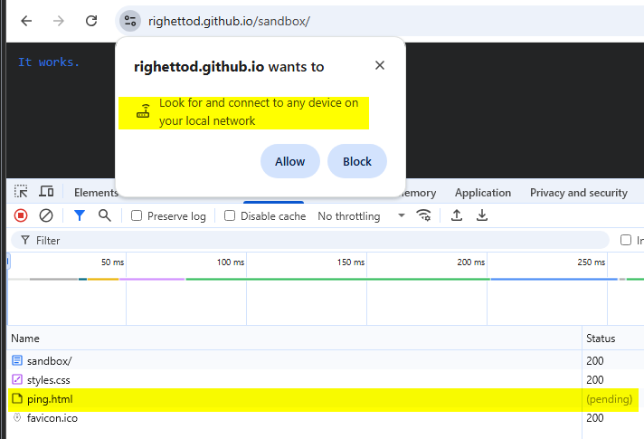
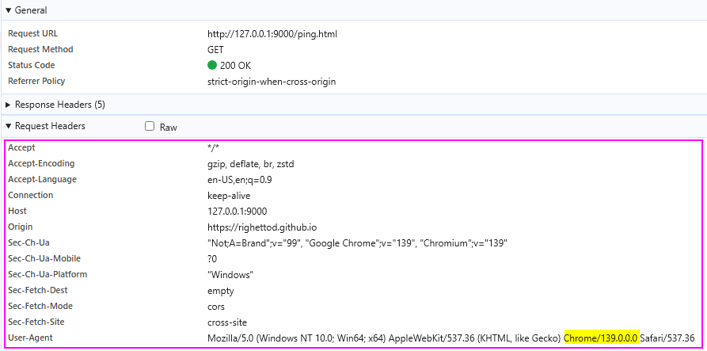

# Miscellaneous

💡 This section provides extra useful information about HTTP Security headers.

* [Private Network Access request header](#private-network-access-request-header)
* [Fetch metadata request header](#fetch-metadata-request-header)

## Request headers

### Private Network Access request header

⚠️ Work on this feature was **put on hold by Google** in favor of a new feature called **[Local Network Access](https://github.com/explainers-by-googlers/local-network-access)** for which *work is in progress*:

* [Private Network Access on hold](https://developer.chrome.com/blog/pna-on-hold).
* [Inquiry About Chrome Origin Trials Extension and Future Availability](https://github.com/WICG/private-network-access/issues/148).
* [Discussion thread about this topic](https://groups.google.com/a/chromium.org/g/blink-dev/c/NCV3anf1KtU/m/WyL9rKjtAQAJ?pli=1).
* [New permission prompt for Local Network Access](https://developer.chrome.com/blog/local-network-access).

🤔 According to our understanding of the **Local Network Access** permission as well as tests performed, this one do not include any special HTTP request header:






#### Description

The [Private Network Access](https://wicg.github.io/private-network-access/) specification provides a feature allowing an application, located on a **[private address](https://wicg.github.io/private-network-access/#ip-address-space-private)**, to identify if the incoming HTTP request was sent from an application located on a **[public address](https://wicg.github.io/private-network-access/#public-address)**.

🎯 The objective is to prevent attack, in which, a page hosted on a public network like, the Internet network, try to send a request to an application hosted on a private network:


📑 [Source](https://developer.chrome.com/blog/private-network-access-update/#what-is-private-network-access) of the schema.

#### Example

💻 Code of a page hosted on Internet on `https://example.com/page.html`:

```html
<!DOCTYPE html>
<html>
<header>
    <title>Evil App</title>
</header>
<body>
    <!-- 
        We try to load an image from the router
        deployed on the local private network.
    -->
    
</body>
</html>
```

💻 Request sent by the browser when the page is loaded (tested on `Chrome 116.x`):

```html
OPTIONS /icon.svg HTTP/1.1
Host: router.local
User-Agent: Chrome/116.0.0.0 Safari/537.36
Accept: */*
Accept-Encoding: gzip, deflate, br
Accept-Language: en-US,en-GB;q=0.9,en;q=0.8
Access-Control-Request-Method: GET
Access-Control-Request-Private-Network: true
Connection: keep-alive
Origin: https://example.com
Referer: https://example.com
Sec-Fetch-Dest: image
Sec-Fetch-Mode: cors
Sec-Fetch-Site: cross-site
```

💬 The browser sent a [CORS preflight request](https://fetch.spec.whatwg.org/#cors-preflight-request) to **notify the application**, located on the private network, about the **cross-network** request that the application, located on the public network, want to perform.

💡 Note the special **request** header: `Access-Control-Request-Private-Network: true`

🤝 If the application on the private network, wants to allow the request, then it will return the following CORS headers that will *make the preflight successful*:

💡 Note the special **response** header: `Access-Control-Allow-Private-Network: true`

```html
HTTP/1.1 200 OK
Access-Control-Allow-Origin: https://example.com
Access-Control-Allow-Methods: GET
Access-Control-Allow-Private-Network: true
...
```

📍 To summarize, the application on the private network, uses its response to the preflight request to allow or not the real request to be performed:

* ✅ **Preflight succeed**: The browser will send the real request (HTTP GET in our example).
* ❌ **Preflight fail**: The browser will NOT send the real request.

#### References

* <https://developer.chrome.com/blog/private-network-access-update>
* <https://wicg.github.io/private-network-access/>
* <https://github.com/WICG/private-network-access>
* <https://portswigger.net/daily-swig/chrome-to-bolster-csrf-protections-with-cors-preflight-checks-on-private-network-requests>
* <https://developer.mozilla.org/en-US/docs/Glossary/Preflight_request>

### Fetch metadata request header

A fetch metadata request header is an HTTP request header that provides additional information about the context from which the request originated. This allows the server to make decisions about whether a request should be allowed based on where the request came from and how the resource will be used .

🔒 These headers are prefixed with `Sec-`, and hence have [forbidden header names](https://developer.mozilla.org/en-US/docs/Glossary/Forbidden_header_name). As such, they *cannot be modified from JavaScript*.

📑 Source [Mozilla MDN](https://developer.mozilla.org/en-US/docs/Glossary/Fetch_metadata_request_header).

🎯 These headers can be leveraged to add protection measures against [XS-Leaks](https://xsleaks.dev/docs/defenses/opt-in/fetch-metadata/) attacks.

#### Sec-Fetch-Dest

The `Sec-Fetch-Dest` fetch metadata request header indicates the request's destination. That is the initiator of the original fetch request, which is where (and how) the fetched data will be used.

📋 Possible values are detailed [here](https://developer.mozilla.org/en-US/docs/Web/HTTP/Headers/Sec-Fetch-Dest#directives).

📑 Source [Mozilla MDN](https://developer.mozilla.org/en-US/docs/Web/HTTP/Headers/Sec-Fetch-Dest).

#### Sec-Fetch-Mode

The `Sec-Fetch-Mode` fetch metadata request header indicates the [mode](https://developer.mozilla.org/en-US/docs/Web/API/Request/mode) of the request: **cors**, **no-cors**, **same-origin**, **navigate** or **websocket**.

Broadly speaking, this allows a server to distinguish between: requests originating from a user navigating between HTML pages, and requests to load images and other resources.

📋 Possible values are detailed [here](https://developer.mozilla.org/en-US/docs/Web/HTTP/Headers/Sec-Fetch-Mode#directives).

📑 Source [Mozilla MDN](https://developer.mozilla.org/en-US/docs/Web/HTTP/Headers/Sec-Fetch-Mode).

#### Sec-Fetch-User

The `Sec-Fetch-User` fetch metadata request header *is only sent for requests initiated by user activation*, and its value will always be `?1`.

📑 Source [Mozilla MDN](https://developer.mozilla.org/en-US/docs/Web/HTTP/Headers/Sec-Fetch-User).

#### Sec-Fetch-Site

The `Sec-Fetch-Site` fetch metadata request header indicates the relationship between a request initiator's origin and the origin of the requested resource.

In other words, this header tells a server whether a request for a resource is coming from the same origin, the same site, a different site, or is a "user-initiated" request. The server can then use this information to decide if the request should be allowed.

📋 Possible values are detailed [here](https://developer.mozilla.org/en-US/docs/Web/HTTP/Headers/Sec-Fetch-Site#directives).

📑 Source [Mozilla MDN](https://developer.mozilla.org/en-US/docs/Web/HTTP/Headers/Sec-Fetch-Site).

💡 Explanation about **Site** vs **Origin** can be found [here](https://web.dev/same-site-same-origin/).

#### Example

```text
GET /www-project-secure-headers/
Host: owasp.org
User-Agent: Chrome/91.0.4472.124
Sec-Fetch-Dest: document
Sec-Fetch-Mode: navigate
Sec-Fetch-Site: cross-site
Sec-Fetch-User: ?1
```

#### References

* <https://developer.mozilla.org/en-US/docs/Glossary/Fetch_metadata_request_header>
* <https://caniuse.com/mdn-http_headers_sec-fetch-dest>
* <https://developer.mozilla.org/en-US/docs/Web/HTTP/Headers/Sec-Fetch-Dest>
* <https://caniuse.com/mdn-http_headers_sec-fetch-mode>
* <https://developer.mozilla.org/en-US/docs/Web/HTTP/Headers/Sec-Fetch-Mode>
* <https://caniuse.com/mdn-http_headers_sec-fetch-user>
* <https://developer.mozilla.org/en-US/docs/Web/HTTP/Headers/Sec-Fetch-User>
* <https://caniuse.com/mdn-http_headers_sec-fetch-site>
* <https://developer.mozilla.org/en-US/docs/Web/HTTP/Headers/Sec-Fetch-Site>
* <https://web.dev/same-site-same-origin/>
* <https://jub0bs.com/posts/2021-01-29-great-samesite-confusion/#are-site-and-origin-interchangeable>
* <https://portswigger.net/daily-swig/firefox-becomes-latest-browser-to-support-fetch-metadata-request-headers>
* <https://xsleaks.dev/docs/defenses/opt-in/fetch-metadata/>
