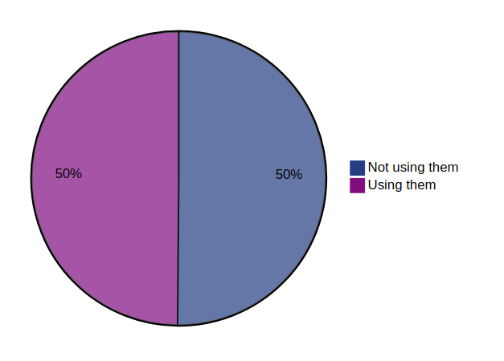
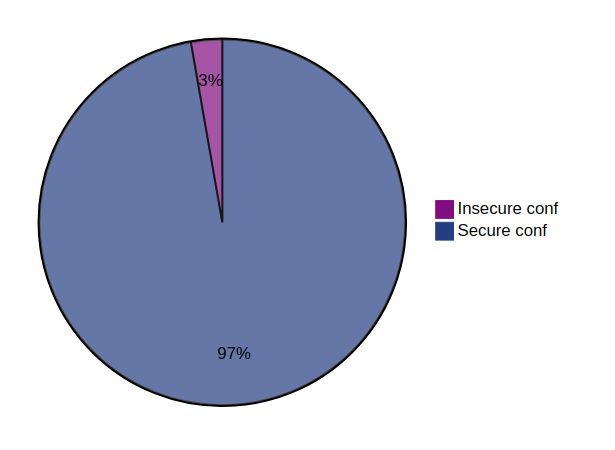
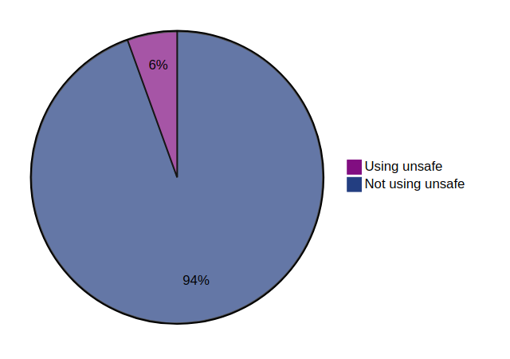

<!-- All the content of this file is generated by the script "ci/tab_stats_generate_md_file.py" -->

<!-- DO NOT EDIT IT MANUALLY -->

# Statistic about HTTP security response headers usage

⏲️ Last update: 02/01/2025 at 20:33:20 - Domains analyzed count: 150000.

## Global usage of secure headers

Provide the distribution of usage of secure headers across all domains analyzed.

## Global usage of header 'Cache-Control'

Provide the distribution of usage of the header 'Cache-Control' across all domains analyzed.

## Global usage of header 'Clear-Site-Data'

Provide the distribution of usage of the header 'Clear-Site-Data' across all domains analyzed.

## Global usage of header 'Content-Security-Policy'

Provide the distribution of usage of the header 'Content-Security-Policy' across all domains analyzed.

## Global usage of header 'Cross-Origin-Embedder-Policy'

Provide the distribution of usage of the header 'Cross-Origin-Embedder-Policy' across all domains analyzed.

## Global usage of header 'Cross-Origin-Opener-Policy'

Provide the distribution of usage of the header 'Cross-Origin-Opener-Policy' across all domains analyzed.

## Global usage of header 'Cross-Origin-Resource-Policy'

Provide the distribution of usage of the header 'Cross-Origin-Resource-Policy' across all domains analyzed.

## Global usage of header 'Permissions-Policy'

Provide the distribution of usage of the header 'Permissions-Policy' across all domains analyzed.

## Global usage of header 'Referrer-Policy'

Provide the distribution of usage of the header 'Referrer-Policy' across all domains analyzed.

## Global usage of header 'Strict-Transport-Security'

Provide the distribution of usage of the header 'Strict-Transport-Security' across all domains analyzed.

## Global usage of header 'X-Content-Type-Options'

Provide the distribution of usage of the header 'X-Content-Type-Options' across all domains analyzed.

## Global usage of header 'X-Frame-Options'

Provide the distribution of usage of the header 'X-Frame-Options' across all domains analyzed.

## Global usage of header 'X-Permitted-Cross-Domain-Policies'

Provide the distribution of usage of the header 'X-Permitted-Cross-Domain-Policies' across all domains analyzed.

## Global usage of insecure framing configuration via the header 'x-frame-options'

Provide the distribution of usage of the header 'x-frame-options' across all domains analyzed with a insecure framing configuration: value different from `DENY` or `SAMEORIGIN` including unsupported values.

## Global usage of insecure referrer configuration via the header 'referrer-policy'

Provide the distribution of usage of the header 'referrer-policy' across all domains analyzed with a insecure referrer configuration: value set to `unsafe-url` or `no-referrer-when-downgrade`.

`no-referrer-when-downgrade` was included because it send origin, path, and querystring when the protocol security level stays the same (HTTPS is very often in place).

## Global usage of the Strict Transport Security 'preload' feature

Provide the distribution of usage of the '[preload](https://developer.mozilla.org/en-US/docs/Web/HTTP/Headers/Strict-Transport-Security#preloading_strict_transport_security)' feature for the header 'strict-transport-security' across all domains analyzed.

## Global common 'max-age' values of the Strict Transport Security header

* Most common value used is 31536000 seconds (525600 minutes) across all domains analyzed.
* Maximum value used is 1234513412313 seconds (20575223539 minutes) across all domains analyzed.
* Minimum value used is -5375190 seconds (-89586 minutes) across all domains analyzed.

## Global usage of content security policy with directives allowing unsafe expressions

Provide the distribution of content security policy allowing unsafe expressions across all domains analyzed.

Determine if a CSP policy contains `(default-src|script-src|script-src-elem|script-src-attr|style-src)` directives using `(unsafe-inline|unsafe-hashes|unsafe-eval)` expressions.

Based on [Report-URI CSP](https://report-uri.com/home/generate) generator allowed instructions for CSP directives.

